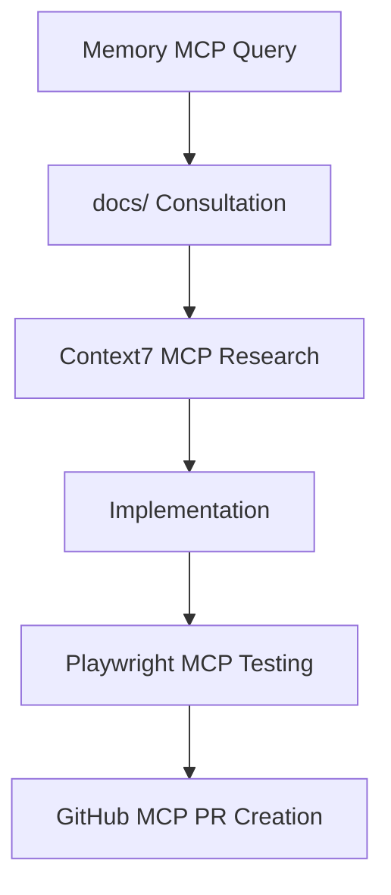
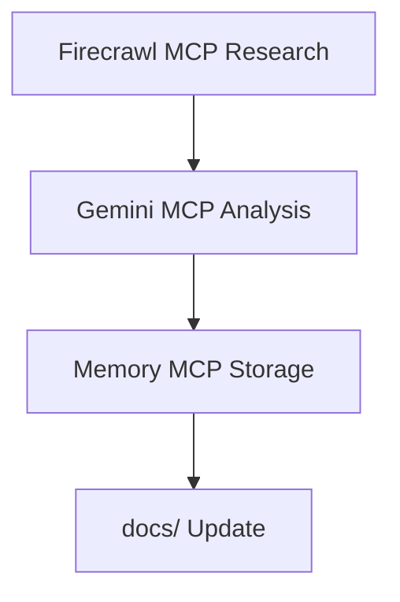

> **M5 MAX Context Engineering System**: This repository features a comprehensive context engineering architecture designed for zero-assumption development and maximum developer velocity.

## 🧠 CONTEXT ENGINEERING OVERVIEW

This repository includes a **complete context engineering system** with 9 specialized documentation files that eliminate guesswork and provide instant access to any architectural information:

### 📚 DOCUMENTATION ARCHITECTURE
```
docs/
├── CONTEXT_MAP.md           → Master inventory with source references
├── ARCHITECTURE_ATLAS.md    → Component relationships & data flow
├── DEVELOPMENT_PLAYBOOKS.md → Step-by-step development guides  
├── COMPONENT_REGISTRY.md    → Complete UI component catalog
├── STATE_MANAGEMENT.md      → Zustand patterns & usage
├── FORM_VALIDATION.md       → Schema validation & lead scoring
├── TEST_COVERAGE_ANALYSIS.md → Gap analysis & improvement roadmap
├── BUILD_PERFORMANCE.md     → Optimization strategies & metrics
└── MEMORY_PROTOCOL.md       → Anti-hallucination system
```

## 🚫 ANTI-HALLUCINATION PROTOCOL

**CRITICAL**: Every architectural claim MUST be backed by source code reference (`file:line`) or marked `UNKNOWN → TODO`. Zero speculation allowed.

### Source Reference Format
```
✅ CORRECT: "Platform detection at 1024px - src/shared/hooks/useIsDesktop.ts:3"
✅ CORRECT: "Form validation with Zod - src/shared/types/forms.ts:4-19"
❌ WRONG: "The app uses responsive design" (no source reference)
❌ WRONG: "Forms are validated" (no implementation location)
```

### Before Making ANY Claim:
1. **Verify source file exists** - Use Read tool to confirm
2. **Reference exact location** - Include file:line citations
3. **Cross-validate facts** - Check multiple sources when possible
4. **Mark uncertainty** - Use `UNKNOWN → TODO` for unverified claims

## 💡 INTELLIGENT DEVELOPMENT WORKFLOW

### 1. RAPID INFORMATION ACCESS
**Before starting any task, consult the relevant docs:**

- **Adding components?** → `docs/COMPONENT_REGISTRY.md` for existing patterns
- **Form work?** → `docs/FORM_VALIDATION.md` for schemas & validation
- **State changes?** → `docs/STATE_MANAGEMENT.md` for Zustand patterns  
- **New features?** → `docs/DEVELOPMENT_PLAYBOOKS.md` for step-by-step guides
- **Performance issues?** → `docs/BUILD_PERFORMANCE.md` for optimization strategies
- **Testing?** → `docs/TEST_COVERAGE_ANALYSIS.md` for gap analysis

### 2. CONTEXT-AWARE DEVELOPMENT
**Use the comprehensive context to:**

- **Find modification points** in <2 minutes using source references
- **Follow established patterns** documented in registries and playbooks
- **Avoid architectural conflicts** by consulting the atlas and context map
- **Implement with confidence** using verified, source-referenced patterns

### 3. QUALITY ASSURANCE INTEGRATION
**Leverage built-in quality intelligence:**

- **Test Coverage**: Only 2.5% (3/121 files) - See `docs/TEST_COVERAGE_ANALYSIS.md` for priorities
- **Performance**: 7-chunk strategy documented - See `docs/BUILD_PERFORMANCE.md`
- **Forms**: Lead scoring system documented - See `docs/FORM_VALIDATION.md`
- **Components**: 45 UI components cataloged - See `docs/COMPONENT_REGISTRY.md`

## ⚡ DEVELOPMENT COMMANDS

**Build & Development:**
- `npm run dev` - Vite development server (localhost:5173)
- `npm run build` - Production build with 7-chunk optimization
- `npm run build:dev` - Development build with debugging
- `npm run preview` - Preview production build

**Quality Gates:**
- `npm run lint` - ESLint (required before commits)
- `npm run test` - Vitest unit tests (currently 2.5% coverage)
- `npm run test:ui` - Vitest UI interface
- `npx tsc --noEmit` - TypeScript strict mode checking

**Performance Analysis:**
- Bundle analysis available - See `docs/BUILD_PERFORMANCE.md`
- Performance budgets defined - Critical path <250KB gzipped
- Lazy loading implemented - ~60% bundle size reduction

## 🏗️ BIFURCATED ARCHITECTURE (Source: `docs/ARCHITECTURE_ATLAS.md`)

**Pattern**: Desktop/mobile separation at component level
**Breakpoint**: 1024px via `useIsDesktop()` hook - `src/shared/hooks/useIsDesktop.ts:3`
**Structure**: Separate `desktop/` and `mobile/` directories per feature

```
src/features/<feature>/
├── pages/FeaturePage.tsx    → Lazy loading container
├── desktop/Feature.tsx      → Desktop implementation  
├── mobile/Feature.tsx       → Mobile implementation
└── components/              → Platform-specific components
```

**Implementation Details**: See `docs/ARCHITECTURE_ATLAS.md` for complete flow diagrams and relationships.

## 🎯 TECHNOLOGY STACK (Source: `docs/CONTEXT_MAP.md`)

**Versions**: React 18.3.1, TypeScript 5.8.3, Vite 5.4.19, Zustand 5.0.8 - `package.json`  
**Build**: SWC compilation, 7-chunk manual splitting - `vite.config.ts:17-41`  
**UI**: Radix UI + shadcn/ui + Tailwind CSS - 45 components cataloged  
**Forms**: React Hook Form + Zod validation + Portuguese messages - `src/shared/types/forms.ts`  
**State**: Single Zustand store with selective persistence - `src/shared/store/appStore.ts:24-65`

## 📋 COMPONENT DEVELOPMENT PATTERNS

**UI Components** (Source: `docs/COMPONENT_REGISTRY.md`):
- **45 total components**, only 1 tested (Button) - `src/shared/ui/button.test.tsx`
- **Variant system** with class-variance-authority - See registry for all options
- **M5 Max theming** with fire/tech/safety color palette - `tailwind.config.ts:106-124`

**Forms** (Source: `docs/FORM_VALIDATION.md`):
- **B2B lead scoring** algorithm with budget/attendees/date factors - `QualificationForm.tsx:32-69`
- **Portuguese validation** messages for Brazilian market
- **Schema-first** validation with automatic TypeScript types

**State Management** (Source: `docs/STATE_MANAGEMENT.md`):

- **Attribution tracking** for UTM parameters and conversion analytics - `src/shared/store/appStore.ts:8-11`
- **GDPR consent** management for analytics compliance - `src/shared/store/appStore.ts:29-36`
- **Modal state** management for conversion workflows - `src/shared/store/appStore.ts:13,47-52`

## 🔍 RAPID REFERENCE SYSTEM

### Instant File Location Guide:
- **Platform detection**: `src/shared/hooks/useIsDesktop.ts:3-27`
- **State management**: `src/shared/store/appStore.ts:24-65`
- **Form validation**: `src/shared/types/forms.ts:4-19`
- **Bundle config**: `vite.config.ts:17-41`  
- **UI components**: `src/shared/ui/` (45 components, see registry)
- **Page routing**: `src/app/router/AppRoutes.tsx:8-12` (3 routes)

### Component Location Patterns:
- **Feature pages**: `src/features/{feature}/pages/{Feature}Page.tsx`
- **Desktop components**: `src/features/{feature}/desktop/`
- **Mobile components**: `src/features/{feature}/mobile/`
- **Shared UI**: `src/shared/ui/{component}.tsx`
- **Layout components**: `src/shared/layout/`

### Import Aliases (Source: `vite.config.ts:46-51`):
```typescript
@app/*     → src/app/*      // App routing & providers
@features/* → src/features/* // Feature modules
@shared/*  → src/shared/*   // Shared components & utilities  
@/*        → src/*          // General src imports
```

## 🚀 PERFORMANCE-FIRST DEVELOPMENT

**Bundle Strategy** (Source: `docs/BUILD_PERFORMANCE.md`):
- **Critical path**: ~167KB gzipped (react-vendor + ui-vendor + utils + icons)
- **On-demand chunks**: ~85KB total (forms, modals, media, advanced UI)
- **Lazy loading**: All page components with Suspense boundaries
- **Tree shaking**: Optimized imports for minimal bundle impact

**Performance Targets**:
- **FCP**: <1.2s, **LCP**: <2.5s, **CLS**: <0.1, **TTI**: <3.5s
- **Bundle budgets**: Critical <250KB, chunks <30KB each
- **Loading strategy**: Critical path first, on-demand for interactions

## 🧪 TESTING INTELLIGENCE

**Current State** (Source: `docs/TEST_COVERAGE_ANALYSIS.md`):
- **Coverage**: 2.5% (3/121 files) - CRITICAL improvement needed
- **Existing tests**: Button component, useIsDesktop hook, utils function
- **Priority gaps**: Forms (0%), State (0%), Pages (0%), Features (0%)

**Testing Strategy**:
- **Priority 1**: Form system & state management (business critical)
- **Priority 2**: Page components & user flows  
- **Priority 3**: UI component library & integrations
- **Target**: 70% coverage with focus on business logic

## 💼 BUSINESS LOGIC UNDERSTANDING

**Lead Generation System** (Source: `docs/FORM_VALIDATION.md`):
- **B2B focus**: Professional fireworks for corporate events
- **Lead scoring**: Budget (30pts) + Attendees (15pts) + Date (20pts) + Company (10pts)
- **Conversion flow**: Hero → Modal → Form → Scoring → WhatsApp/Email

**Market Focus**:

- **Portuguese-speaking**: Brazilian market with localized content
- **Event types**: Réveillon, weddings, corporate events, festivals
- **Safety emphasis**: Professional-grade safety protocols

## 🔄 CONTEXT MAINTENANCE PROTOCOL

**Memory Integrity** (Source: `docs/MEMORY_PROTOCOL.md`):
- **Verification cycle**: Check source files before major claims
- **Update triggers**: package.json, vite.config.ts, store files changes
- **Quality control**: All architectural decisions must be documented
- **Session continuity**: Use docs for consistent knowledge across sessions

**Development Session Protocol**:
1. **Start**: Verify critical facts from docs
2. **Development**: Reference appropriate docs for patterns
3. **Quality**: Run lint, test, build before commits
4. **Documentation**: Update docs if architecture changes

---

## 🎯 ULTRA-EFFICIENT DEVELOPMENT APPROACH

**This repository is optimized for maximum developer velocity through:**

1. **Zero Assumption Development**: Every fact is source-referenced
2. **Instant Context Access**: Any architectural question answerable in <2 minutes  
3. **Pattern Consistency**: All development patterns documented and examples provided
4. **Quality Integration**: Testing, performance, and optimization strategies built-in
5. **Business Alignment**: Deep understanding of M5 Max business model and conversion flows

## 🔧 MCP INTEGRATION SYSTEM

This project leverages **9 specialized MCP servers** to create the most advanced AI-assisted development environment. Each MCP provides specific capabilities that complement the Context Engineering architecture.

### **Available MCP Servers & Capabilities**

**🗄️ Data & Backend:**
- **Supabase MCP** - Database operations, migrations, real-time queries, edge functions
- **Memory MCP** - Project knowledge graph with 25+ entities and 33+ architectural relationships

**📚 Documentation & Analysis:**  
- **Context7 MCP** - Up-to-date library documentation and code examples
- **Gemini CLI MCP** - Deep analysis for large codebases, brainstorming, complex reviews

**🔧 Development & Testing:**
- **Filesystem MCP** - Advanced file operations, directory management, batch processing
- **Playwright MCP** - Browser automation, E2E testing, UI validation
- **IDE MCP** - VS Code diagnostics, code execution, development insights

**🚀 Deployment & Collaboration:**
- **GitHub MCP** - Repository management, PR workflows, issue tracking, code reviews
- **Firecrawl MCP** - Web content analysis, research, competitive intelligence

### **MCP Best Practices**

**For Large Analysis Tasks (>50 files):**
```bash
Use Gemini MCP with larger context window:
mcp__gemini-cli__ask-gemini --model=gemini-2.5-flash
```

**For Architectural Decisions:**
```bash
1. Query Memory MCP first: mcp__Memory__search_nodes
2. Cross-reference with docs/
3. Implement with established patterns
```

**For Testing (Critical Gap - 2.5% coverage):**
```bash
Use Playwright MCP for comprehensive E2E testing:
mcp__Playwright__playwright_navigate + test workflows
```

**For Library Research:**
```bash
Get latest docs via Context7 MCP:
mcp__context7__resolve-library-id → mcp__context7__get-library-docs
```

## 🧠 INTELLIGENT DEVELOPMENT WORKFLOWS

### **MCP-Powered Context Engineering**

**Before Any Development Task:**
1. **Query Memory MCP** for existing patterns and architectural decisions
2. **Consult relevant docs/** for established guidelines  
3. **Use Context7 MCP** for updated library documentation
4. **Apply Gemini MCP** for complex analysis requiring large context windows

### **Quality Assurance Integration**

**Testing Strategy (Addressing 2.5% Coverage Gap):**
- **Playwright MCP** for E2E testing automation
- **GitHub MCP** for PR workflows and code reviews
- **IDE MCP** for development-time diagnostics and quality checks

**Performance & Build Optimization:**
- **Filesystem MCP** for batch file operations and build analysis
- **Gemini MCP** for bundle analysis and optimization recommendations
- **Supabase MCP** for database performance monitoring

### **Advanced Workflows**

**Feature Development Lifecycle:**


**Research & Analysis Pipeline:**


## 📚 ENHANCED MEMORY PROTOCOL

### **Memory MCP Integration**

**Triple-Verification System:**
1. **docs/ System** - Static documentation with `file:line` references
2. **Memory MCP** - Dynamic project knowledge graph with relationships  
3. **Source Code** - Ground truth verification

**Memory-Driven Development:**
- Query `mcp__Memory__search_nodes` before architectural claims
- Update `mcp__Memory__create_entities` for new patterns/decisions
- Use `mcp__Memory__add_observations` to evolve understanding

### **Anti-Hallucination 2.0**

**Enhanced Verification Protocol:**
```
✅ CORRECT: "Platform detection at 1024px - src/shared/hooks/useIsDesktop.ts:3 + Memory MCP entity: 'Bifurcated Architecture'"
❌ WRONG: Any claim without triple verification (docs/ + Memory MCP + source)
```

**Workflow:**
1. **Claim Formation** - Make architectural statement
2. **docs/ Verification** - Check static documentation
3. **Memory MCP Query** - Validate against knowledge graph
4. **Source Confirmation** - Verify in actual code
5. **Update Protocol** - Sync any discrepancies across all three sources

## ⚡ MCP QUICK REFERENCE

### **Development Shortcuts**

**Deep Analysis & Reviews:**
```bash
# For complex codebase analysis (>50 files)
mcp__gemini-cli__ask-gemini --model=gemini-2.5-flash "Analyze entire feature architecture @src/features/"

# For brainstorming new features
mcp__gemini-cli__brainstorm --domain=software --ideaCount=15
```

**Memory & Context Queries:**
```bash
# Check existing patterns before implementation  
mcp__Memory__search_nodes --query="form validation patterns"

# Cross-reference architectural decisions
mcp__Memory__open_nodes --names=["Bifurcated Architecture", "Lead Scoring Algorithm"]
```

**Testing & Quality Assurance:**
```bash
# E2E testing for critical user flows
mcp__Playwright__playwright_navigate --url="localhost:5173"
mcp__Playwright__playwright_screenshot --name="homepage-test"

# GitHub workflow integration
mcp__github__create_pull_request --title="Feature Implementation" --head="feature-branch"
```

**Research & Documentation:**
```bash
# Get latest library documentation
mcp__context7__resolve-library-id --libraryName="react-hook-form"
mcp__context7__get-library-docs --topic="validation"

# Web research for competitive analysis
mcp__firecrawl-mcp__firecrawl_search --query="React form libraries 2025"
```

### **Critical Gap Mitigation**

**Testing Coverage Strategy (Current: 2.5% → Target: 70%):**

**Priority 1 - Business Logic (0% → 60%):**
```bash
# Form system testing
mcp__Playwright__playwright_fill + validation workflows
# State management testing  
Test Zustand store mutations and persistence
# Page component testing
E2E user journeys for all conversion flows
```

**Priority 2 - UI Components (2% → 80%):**
```bash  
# Component library testing
45 components → Playwright visual regression testing
# Responsive behavior testing
Desktop/mobile bifurcation validation
```

**Priority 3 - Integration Testing (0% → 50%):**
```bash
# Analytics integration testing
UTM tracking, conversion funnels, GDPR compliance
# WhatsApp Business integration testing
Lead scoring and attribution preservation
```

## 🎯 MCP-ENHANCED DEVELOPMENT APPROACH

**This repository now combines the original Context Engineering system with MCP superpowers:**

1. **Zero Assumption Development** - Every fact triple-verified (docs/ + Memory MCP + source)
2. **Instant Context Access** - Any question answerable via specialized MCP in <2 minutes  
3. **Pattern Consistency** - Memory MCP enforces architectural decisions across sessions
4. **Quality Integration** - Playwright MCP addresses critical testing gap
5. **Business Alignment** - Supabase MCP enables data-driven decision making
6. **Research Acceleration** - Firecrawl + Context7 MCPs for external intelligence
7. **Advanced Analysis** - Gemini MCP for complex reviews without token limits

**Always consult the `docs/` directory first, then leverage appropriate MCPs for enhanced capabilities. The comprehensive documentation + MCP integration eliminates guesswork and ensures consistent, high-quality development.**