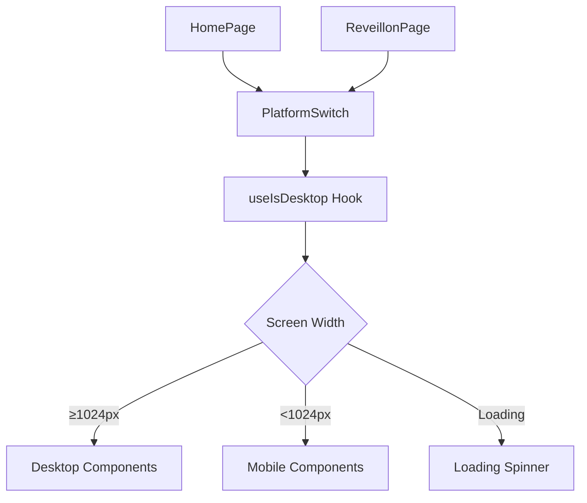
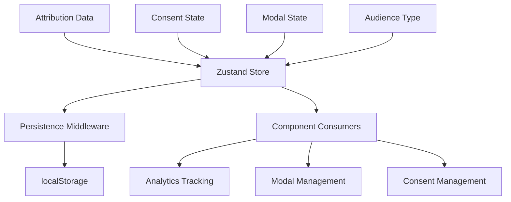
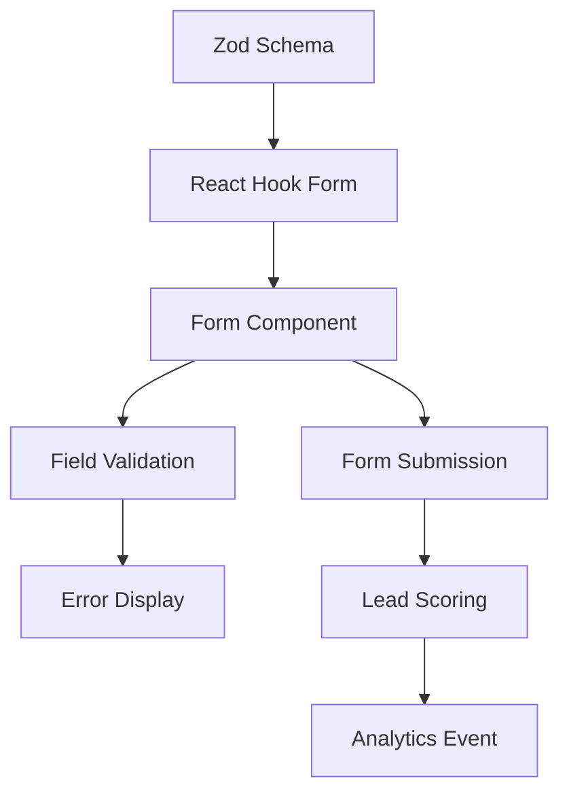
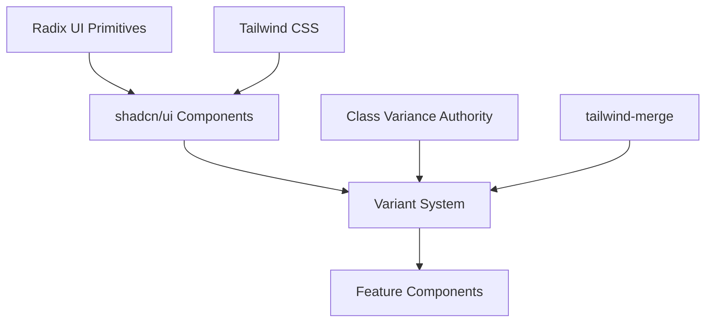
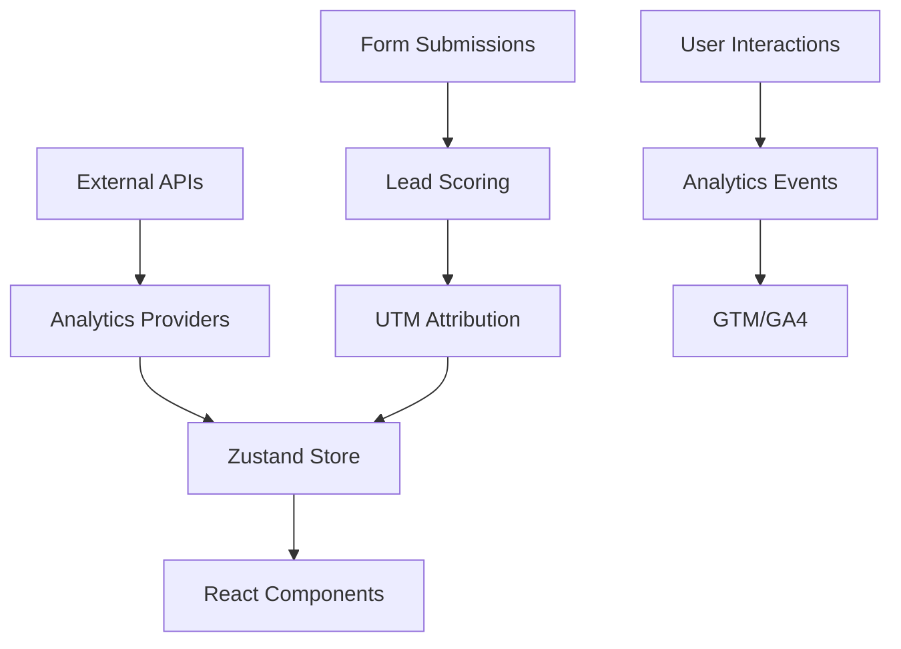
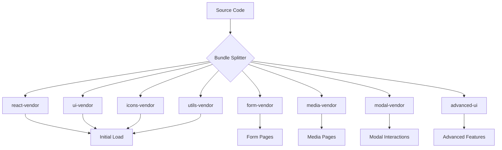

# ARCHITECTURE ATLAS - M5 MAX

> **Purpose**: Visual component & data flow mapping with comprehensive file structure inventory and relationships.

## APPLICATION BOOTSTRAP FLOW

### Entry Point Sequence
```mermaid
graph TD
    A[src/main.tsx] --> B[src/App.tsx]
    B --> C[AppProviders]
    C --> D[AppRoutes]
    D --> E[HomePage | ReveillonPage]
    E --> F[PlatformSwitch]
    F --> G[Desktop | Mobile Components]
```

**Detailed Flow**:
1. **`src/main.tsx`** → React.render() entry point
2. **`src/App.tsx:4-8`** → Wraps routes with providers  
3. **`src/app/providers/AppProviders.tsx`** → Context providers setup
4. **`src/app/router/AppRoutes.tsx:8-12`** → Route definitions
5. **`src/features/*/pages/*.tsx`** → Lazy-loaded page containers
6. **Platform Detection** → `useIsDesktop()` at 1024px breakpoint
7. **Component Rendering** → Desktop/Mobile specific implementations

## COMPREHENSIVE FILE STRUCTURE INVENTORY

### Application Layer (`src/app/`)
```
app/
├── layouts/
│   └── RootLayout.tsx              // Base application layout
├── providers/
│   ├── AppProviders.tsx            // Provider composition
│   ├── ThemeProvider.tsx           // Theme management
│   └── analytics/
│       ├── AnalyticsProvider.tsx   // GTM/GA4 integration  
│       └── ConsentBanner.tsx       // GDPR consent UI
└── router/
    ├── AppRoutes.tsx              // Route definitions (3 routes)
    └── NotFound.tsx               // 404 fallback page
```

### Feature Layer (`src/features/`)
```
features/
├── home/                          // Homepage feature module
│   ├── pages/
│   │   └── HomePage.tsx           // Lazy loading container
│   ├── desktop/
│   │   ├── Home.tsx              // Desktop implementation
│   │   ├── components/
│   │   │   ├── FAQ.tsx           // Desktop-specific FAQ
│   │   │   ├── FogosM5Complete.tsx // Desktop showcase  
│   │   │   └── Hero.tsx          // Desktop hero section
│   │   └── data/
│   │       └── homeContent.ts    // Content definitions
│   ├── mobile/
│   │   ├── Home.tsx              // Mobile implementation  
│   │   └── components/
│   │       ├── FAQ.tsx           // Mobile-specific FAQ
│   │       ├── FogosM5Complete.tsx // Mobile showcase
│   │       └── Hero.tsx          // Mobile hero section
│   └── index.ts                   // Feature exports
└── reveillon/                     // New Year's feature module
    ├── pages/
    │   └── ReveillonPage.tsx      // Lazy loading container
    ├── desktop/
    │   ├── Reveillon.tsx          // Desktop implementation
    │   ├── components/
    │   │   ├── FAQ.tsx            // Desktop-specific FAQ
    │   │   ├── FogosM5Complete.tsx // Desktop showcase
    │   │   ├── ReveillonCallToAction.tsx // CTA section
    │   │   ├── ReveillonHero.tsx  // Hero section
    │   │   ├── Services.tsx       // Services display
    │   │   └── TimelineSection.tsx // Event timeline
    │   └── data/
    │       └── homeContent.ts     // Content definitions
    ├── mobile/
    │   ├── Reveillon.tsx          // Mobile implementation
    │   └── components/
    │       ├── ReveillonCallToAction.tsx // Mobile CTA
    │       └── TimelineSection.tsx // Mobile timeline
    └── index.ts                   // Feature exports
```

### Shared Layer (`src/shared/`)
```
shared/
├── data/
│   └── faqData.ts                 // FAQ content definitions
├── hooks/
│   ├── index.ts                   // Hook barrel exports
│   ├── useAnalytics.ts           // Analytics tracking hook
│   ├── useAttribution.ts         // UTM attribution hook  
│   ├── useIsDesktop.ts           // Platform detection (1024px)
│   ├── useIsDesktop.test.ts      // Platform tests
│   ├── useMedia.ts               // Media query utilities
│   └── useToast.ts               // Toast notification hook
├── layout/
│   ├── index.ts                   // Layout barrel exports  
│   ├── DifferentialsSection.tsx   // Product differentials
│   ├── FAQ.tsx                    // Shared FAQ component
│   ├── Footer.tsx                 // Application footer
│   ├── Header.tsx                 // Application header
│   ├── LazySection.tsx            // Lazy-loaded sections
│   ├── SectionSeparator.tsx       // Visual separators
│   ├── Services.tsx               // Services showcase
│   └── lazy-layout.tsx            // Lazy layout components
├── lib/
│   ├── index.ts                   // Utility barrel exports
│   ├── analytics.ts              // Analytics utilities
│   ├── assets.ts                 // Asset management
│   ├── config.ts                 // Application configuration
│   ├── constants.ts              // Application constants  
│   ├── gtm.ts                    // Google Tag Manager
│   ├── utm.ts                    // UTM parameter handling
│   ├── utils.ts                  // General utilities (tested)
│   ├── utils.test.ts             // Utility tests
│   └── whatsapp.ts               // WhatsApp integration
├── modal/
│   ├── index.ts                   // Modal barrel exports
│   ├── B2BForm.tsx               // B2B lead capture form
│   ├── ContactModal.tsx          // Contact modal dialog
│   ├── ConversionModal.tsx       // Conversion tracking modal
│   ├── QualificationForm.tsx     // Lead qualification form
│   └── lazy-modals.tsx           // Lazy-loaded modals
├── store/
│   ├── index.ts                   // Store barrel exports
│   └── appStore.ts               // Zustand store (persistence)
├── types/
│   ├── analytics.ts              // Analytics type definitions
│   ├── common.ts                 // Shared type definitions
│   └── forms.ts                  // Form & Zod schemas
├── ui/
│   ├── index.ts                   // UI barrel exports
│   ├── button.tsx                // Button component (tested)
│   ├── button.test.tsx           // Button tests  
│   ├── button.variants.ts        // Button styling variants
│   ├── badge.tsx                 // Badge component
│   ├── badge.variants.ts         // Badge styling variants
│   ├── lazy-ui.tsx               // Lazy-loaded UI components
│   ├── optimized-image.tsx       // Optimized image component
│   ├── video-player.tsx          // Video player component
│   ├── video-player-simple.tsx   // Simple video player
│   ├── youtube-embed.tsx         // YouTube embed component
│   └── [30+ shadcn/ui components] // Complete shadcn/ui suite
├── utils/
│   └── service-worker.ts         // Service worker utilities
├── index.ts                       // Shared barrel exports
└── PlatformSwitch.tsx            // Platform detection component
```

## COMPONENT RELATIONSHIPS

### Platform Detection System


**Key Files**:
- **Detection**: `src/shared/hooks/useIsDesktop.ts:3-27`
- **Switch**: `src/shared/PlatformSwitch.tsx:11-26`
- **Breakpoint**: 1024px constant (`useIsDesktop.ts:3`)

### Lazy Loading Architecture
```mermaid
graph TD
    A[Page Container] --> B[React.lazy]
    B --> C[Dynamic Import]
    C --> D[Suspense Boundary]
    D --> E[Loading Component]
    D --> F[Loaded Component]
    
    G[HomePage.tsx:5-6] --> H[HomeDesktop | HomeMobile]
    I[ReveillonPage.tsx] --> J[ReveillonDesktop | ReveillonMobile]
```

**Pattern Implementation**:
```typescript
// src/features/home/pages/HomePage.tsx:5-6
const HomeDesktop = lazy(() => import('../desktop/Home'));
const HomeMobile = lazy(() => import('../mobile/Home'));
```

### State Management Flow


**Store Structure** (`src/shared/store/appStore.ts:7-22`):
- **Attribution**: UTM and referrer tracking
- **Consent**: GDPR-compliant analytics consent
- **UI State**: Modal visibility and audience targeting
- **Persistence**: Selective localStorage with TTL

### Form & Validation Flow  


**Schema Definition** (`src/shared/types/forms.ts:4-19`):
```typescript
export const B2BFormSchema = z.object({
  eventType: z.enum(['reveillon', 'festa-junina', 'casamento', 'festival', 'outro']),
  cityUF: z.string().min(1, 'Cidade/UF obrigatório'),
  // ... 15 more validated fields
});
```

## IMPORT/EXPORT RELATIONSHIPS

### Barrel Export Pattern
**Feature Exports** (`src/features/home/index.ts:4-12`):
```typescript
export { default as Home } from './pages/HomePage';
export { default as HomeDesktop } from './desktop/Home';  
export { default as Hero } from './desktop/components/Hero';
export { default as HomeMobile } from './mobile/Home';
```

**Shared Exports** (`src/shared/layout/index.ts:1-13`):
```typescript
export { default as Header } from './Header';
export { default as Footer } from './Footer';
export { default as Services } from './Services';
// ... 7 more layout components
export * from './lazy-layout';
```

### Import Alias Usage (`vite.config.ts:46-51`)
```typescript
'@app/*'      → 'src/app/*'      // App-level imports
'@features/*' → 'src/features/*' // Feature-specific imports
'@shared/*'   → 'src/shared/*'   // Shared resource imports
'@/*'         → 'src/*'          // General src imports
```

## DEPENDENCY RELATIONSHIPS

### UI Component Dependencies


**Component Categories**:
- **Primitives**: 25+ Radix UI components (`package.json:17-43`)
- **Styled**: shadcn/ui implementations (`src/shared/ui/`)  
- **Variants**: Styling systems (`*.variants.ts` files)
- **Custom**: Domain-specific components (`src/features/*/components/`)

### Data Flow Dependencies


## TESTING COVERAGE MAP

### Current Test Files
- **Components**: `src/shared/ui/button.test.tsx:1-25`
- **Hooks**: `src/shared/hooks/useIsDesktop.test.ts`  
- **Utilities**: `src/shared/lib/utils.test.ts`

### Testing Architecture
```mermaid
graph TD
    A[Vitest] --> B[Testing Library]
    B --> C[jsdom Environment]
    C --> D[Component Tests]
    
    E[Test Setup] --> F[setupTests.ts]
    F --> G[@testing-library/jest-dom]
    
    H[Vite Config] --> I[Test Environment]
    I --> J[CSS Processing]
    I --> K[Global Test Settings]
```

**Configuration** (`vite.config.ts:58-63`):
- **Framework**: Vitest with globals
- **Environment**: jsdom for DOM testing
- **Setup**: `src/setupTests.ts` for jest-dom matchers
- **CSS**: Enabled for styled component testing

## BUILD CHUNK RELATIONSHIPS

### Manual Chunk Strategy (`vite.config.ts:17-41`)


**Chunk Rationale**:
- **Critical Path**: React, basic UI, icons, utils loaded first
- **Feature-Based**: Forms, media, modals loaded on-demand
- **Advanced**: Complex UI components deferred until needed

---

## ARCHITECTURAL PRINCIPLES

### Design Patterns
1. **Bifurcated Architecture**: Desktop/mobile separation at component level
2. **Lazy Loading**: All route components use React.lazy() + Suspense
3. **Platform Detection**: SSR-safe 1024px breakpoint detection
4. **Barrel Exports**: Organized re-export patterns for clean imports
5. **Chunk Optimization**: Strategic bundle splitting for performance

### Anti-Patterns Avoided
- ❌ Shared components between desktop/mobile (maintains separation)
- ❌ Synchronous route loading (all routes lazy-loaded)
- ❌ Monolithic bundles (7 strategic chunks for optimal loading)
- ❌ Platform detection in render (hooks for SSR safety)

### Scalability Considerations
- **Feature Addition**: Follow bifurcated pattern with lazy loading
- **Component Growth**: Use barrel exports and chunk optimization  
- **State Expansion**: Zustand slices with persistence middleware
- **Test Coverage**: Expand from current 3 test files to comprehensive suite